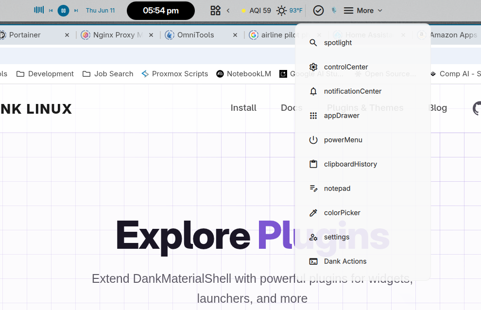

# Dropdown Menu

A [DankMaterialShell](https://github.com/AvengeMedia/DankMaterialShell) (DMS) bar plugin that adds a configurable button to the bar which opens a **dropdown menu** of actions, plugin toggles, popouts, and DMS IPC commands.

> Status: **beta** (v0.5.0)

## Screenshots



## Features

- **One bar button → a menu of anything.** Build a dropdown of mixed item types:
  - **Custom Action** — run any shell command.
  - **Plugin** — toggle/open a plugin, **Open its popout** (for widgets on the bar), or run one of its **detected IPC actions**.
  - **IPC Command** — pick any live `dms ipc` target + function (auto-discovered from your running shell).
- **Per-plugin action detection** — selecting a plugin scans it for `IpcHandler` actions and offers them directly (e.g. a Pomodoro plugin exposes *Start Work*, *Reset*, …).
- **Quick Add** chips for common DMS panels (Control Center, Notifications, Clipboard, …) — one click to add, with live "already added" highlighting.
- **Smart plugin list** — only shows plugins you can actually drive from the menu, and flags ones that are **not enabled** or **not on a bar**.
- **Full Material icon picker** (searchable, all ~4000 symbols) for the button and each item.
- **Display modes** — show icon, text, or both, per bar pill and per item.
- **Multiple dropdowns** via variants — each is a separate bar widget.
- Click-to-edit, reorder, and remove items; collapsible editor.

## Requirements

- DankMaterialShell (quickshell-based) with the plugin system.
- `dms` CLI on `PATH` (used for IPC actions).

## Install

### From the DMS plugin registry (once published)

```sh
dms plugins install dropdownMenu
```

### Manual

Clone into your DMS plugins directory:

```sh
git clone https://github.com/rdannenbring/dropdown-menu.git \
  ~/.config/DankMaterialShell/plugins/dropdownMenu
```

Then enable it in **DMS Settings → Plugins**, configure a dropdown, and add it to your bar via **Bar Settings → Add Widget**.

## Usage

1. Enable the plugin in **Settings → Plugins** and open its settings.
2. Create a dropdown, then click it to edit.
3. Add items (Custom Action / Plugin / IPC Command); use Quick Add for common panels.
4. Set the bar pill's icon, label, and display mode.
5. **Bar Settings → Add Widget** to place the dropdown on your bar.

Clicking the dropdown on the bar opens/closes its menu.

## Permissions

`settings_read`, `settings_write`, `process` (to run shell/IPC commands).

## How it works

Each dropdown is a DMS plugin **variant**, so multiple dropdowns are independent bar widgets. The bar pill is a `PluginComponent`; the menu is its popout.

**Files**

- `DropdownWidget.qml` — the bar pill + popout; dispatches item clicks.
- `DropdownItem.qml` — a single menu row.
- `DropdownSettings.qml` — the editor (variants, items, IPC discovery, validation).
- `DropdownIconPicker.qml` — searchable Material-symbol picker.

**Item model** (stored in variant data)

- `action` — `{ command }`, run via `Process` (`sh -c`).
- `plugin` — `{ pluginId }`, toggled via `PluginService.togglePlugin` or a built-in `PopoutService` toggle.
- `popout` — `{ widgetId }`, opened via `BarWidgetService.triggerWidgetPopout` (the widget must be on a bar).
- IPC actions are stored as `action` items whose command is `dms ipc <target> <fn> [args]` — reusing the action execution path.

**Discovery**

- Global IPC targets/functions come from parsing `dms ipc --help` (the running shell's live handlers).
- Per-plugin actions: the selected plugin's QML is grepped for `IpcHandler { target: "…" }` and intersected with the live target list, so only working actions are offered.

## License

[MIT](LICENSE)
